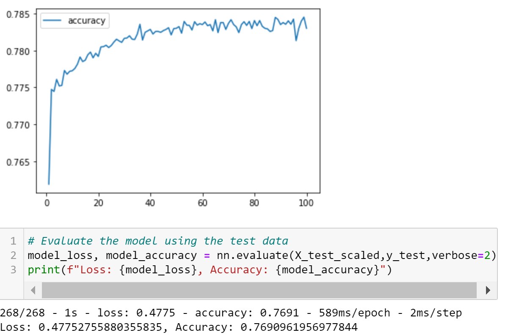
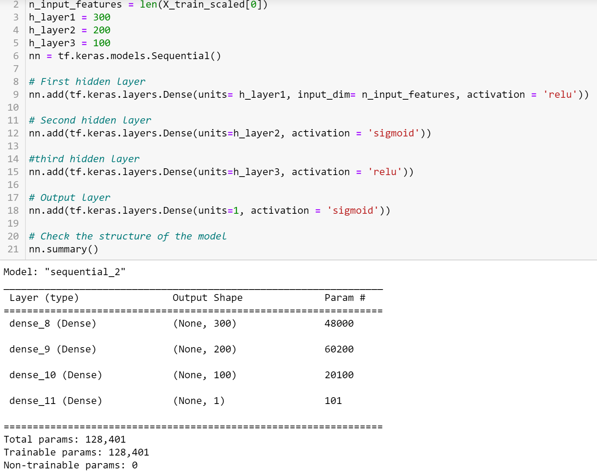
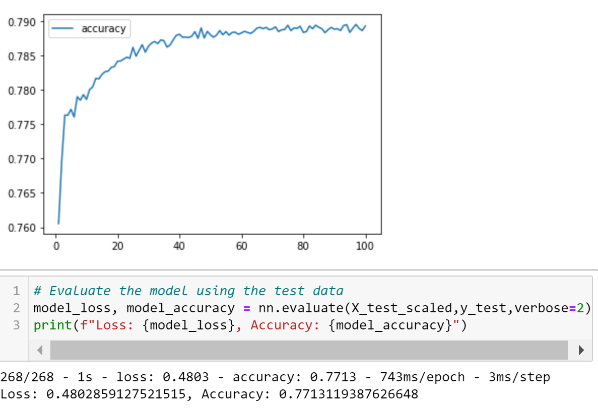
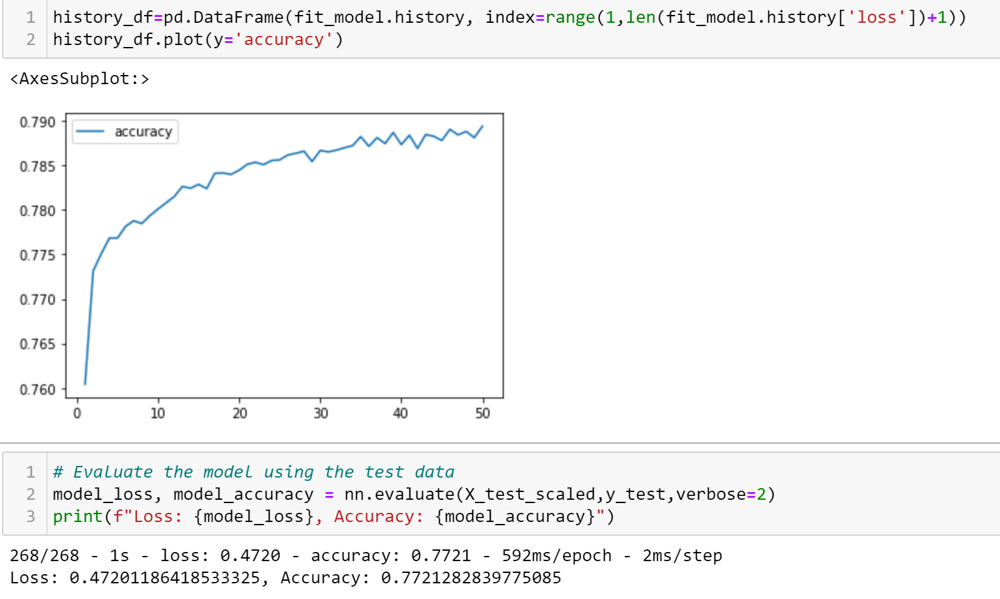
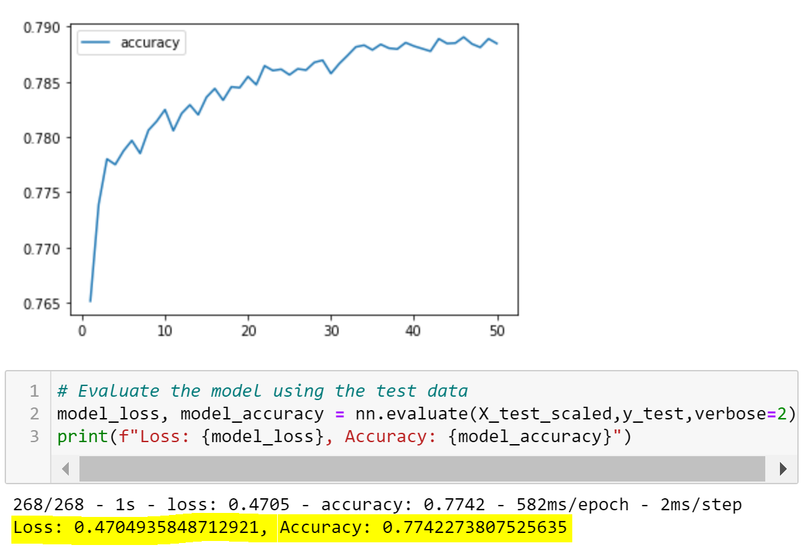

# Neural Network Charity Analysis

## Overview of the analysis
Neural Network Charity Analysis program uses Deep Learning Models to analyze over 34,000 organizations that have received funding from business team will be successful. We use dataset features and target to help foundation predict the company's investment. Our goal is to optimize the Neural Network Deep Learning Model to achieve a target predictive accuracy more than 75%. 

## Results
Using bulleted lists and images to support your answers, address the following questions.

### Data Preprocessing
- Target: 'IS_SUCCESSFUL' that predict whether applicants will be successful if funded by Alphabet Soup Business.
- Features: 
   - 'NAME' that will be binned, considered as not feature.
   - 'APPLICATION_TYPE' that will be binned
   - 'AFFILIATION'
   - 'CLASSIFICATION'that will be binned
   - 'USE_CASE'
   - 'ORGANIZATION' that will be considered as not feature.
   - 'INCOME_AMT'
   - 'ASK_AMT' that will be considered to bin.
- Neither Targets nor Features: 
   - 'EIN'
   - 'STATUS'
   - 'SPECIAL_CONSIDERATIONS' 
   
  (**Dataset has 2 unique values in each columns will be removed for data analysis**)

### Compiling, Training, and Evaluating the Model
#### First Attempt: Accuracy *76.91%* 
In order to achieve a target predictive accuracy that over 75%, we adjust the input data to ensure that there are no variables or outliers that might confuse in the model.
- Drop few more columns such as 'ORGANIZATION', 'STATUS', 'SPECIAL_CONSIDEATIONS'.
   - Create 2 Bins for feature ASK_AMT. 
   - Add additional feature and make 122bins.
   - Decrease the number of values for CLASSIFICATION Bins from 6 to 4.
   - Decrease the number of values for APPLICATION_TYPE Bins from 9 to 8
- Add more hidden layers & Using different activation functions
   - Add additional layers by using sigmoid activation, which improve the performance of accuracy. And sigmid activation is better to identified by a characteristics. Through this process, it will help the model with classification.
   - Total params from 5,981 increased to 56,601

      See attachment for more details:

  

   

   
- Evauation for 1st attempt: 
We plot the history accuracy data to visualize the result. Accuracy is 76.91%.

   

#### Second Attempt: achieved the target model accuracy. Accuracy *77.13%*
- Adjusting the input data
   - Increase input features
   - Unbinned features ASK_AMOUNT
- Adding more neurons to a hidden layer.
   - layer 1 increased 100 by using relu activation
   - layer 2 increased 100 by using sigmoid activation
   - layer 3 increased 50 by using relu activation that helps the model toassess input data differently and lower complexity features.
   - Total params to 128,401

      See attachment for more details:
      

   
  
 

  
- Evauation for 2st attempt: 
We plot the history accuracy figure to visualize the result. We increased the accuracy by 0.22%.

   

   

#### Third Attempt: achieved the target model accuracy. Accuracy *77.21%*
- Adding or reducing the number of epochs to the training regimen.
   - Decrease epochs from 100 to 50 
- Evauation for 3st attempt:
As we see the hisotry of accuracy, the figure shows the accuracy imporved by 0.08%.

#### Final Attempt: achieved the target model accuracy. Accuracy *77.42%*
- Adjusting the input data
   - Increase the number of bins for NAME to 100
- Optimize the numbers of hidden layers
  - layer 1: 200 by using 'relu' activation
  - layer 2: 100 by using 'relu' activation
  - layer 3: 50 by using 'sigmoid' activation
- Optimize the number of epochs to the training regimen.
   - Set epochs to 50
   - Total params: 57,801

- Evauation for final attempt: 
According to the figure, the final attempt increased the accuracy by **0.21%**, and total improved performance by **4.98%**.

   
    

#### Resources:
Explaination for each columns that capture metadata:
  - EIN and NAME — Identification columns
  - APPLICATION_TYPE — Alphabet Soup application type
  - AFFILIATION — Affiliated sector of industry
  - CLASSIFICATION — Government organization classification
  - USE_CASE — Use case for funding
  - ORGANIZATION — Organization type
  - STATUS — Active status
  - INCOME_AMT — Income classification
  - SPECIAL_CONSIDERATIONS — Special consideration for application
  - ASK_AMT — Funding amount requested
  - IS_SUCCESSFUL — Was the money used effectively

## Summary
Summarize the overall results of the deep learning model. Include a recommendation for how a different model could solve this classification problem, and explain your recommendation.
