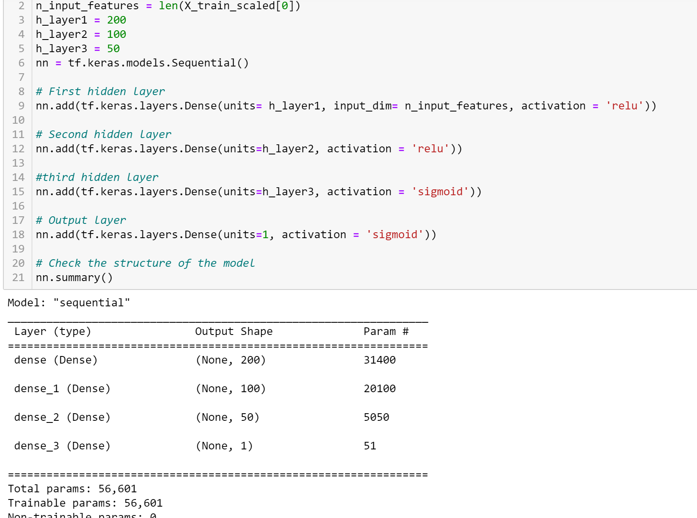

# Neural Network Charity Analysis

## Overview of the analysis
Neural Network Charity Analysis program uses Deep Learning Models to analyze over 34,000 organizations that have received funding from business team will be successful. We use dataset features and target to help foundation predict the company's investment. Our goal is to optimize the Neural Network Deep Learning Model to achieve a target predictive accuracy more than 75%. 

## Results
Using bulleted lists and images to support your answers, address the following questions.

### Data Preprocessing
- Target: 'IS_SUCCESSFUL' that predict whether applicants will be successful if funded by Alphabet Soup Business.
- Features: 
   - 'NAME' that will be binned, considered as not feature.
   - 'APPLICATION_TYPE' that will be binned
   - 'AFFILIATION'
   - 'CLASSIFICATION'that will be binned
   - 'USE_CASE'
   - 'ORGANIZATION' that will be considered as not feature.
   - 'INCOME_AMT'
   - 'ASK_AMT' that will be considered to bin.
- Neither Targets nor Features: 
   - 'EIN'
   - 'STATUS'
   - 'SPECIAL_CONSIDERATIONS' 
   
  (**Dataset has 2 unique values in each columns will be removed for data analysis**)

### Compiling, Training, and Evaluating the Model
#### First Attempt: achieved the target model accuracy. Accuracy *76.91%*
- Add additional layers by using sigmoid activation that might improve the performance of accuracy. And sigmid activation is better to identified by a characteristic, and will help the model with classification.
- Total params from 5,981 increased to 56,601
- Decrease the number of values for CLASSIFICATION Bins from 6 to 4.
- Decrease the number of values for APPLICATION_TYPE Bins from 9 to 8
- Add additional feature and make 122bins.
- Create 2 Bins for feature ASK_AMT. 
See attachment for more details:

  

- Evauation for 1st attempt: see history accuracy figure

    

#### Second Attempt: achieved the target model accuracy. Accuracy *77.13%*
- Increase Total params 128,401
- Increase input features
- Unbinned features ASK_AMOUNT
- Increase neurons on hidden layers
   - layer 1 increased 100 by using relu activation
   - layer 2 increased 100 by using sigmoid activation
   - layer 3 increased 50 by using relu activation that helps the model toassess input data differently and lower complexity features.

See attachment for more details:

  
  
- Evauation for 2st attempt: see history accuracy figure

    
    
#### Third Attempt: achieved the target model accuracy. Accuracy *77.21%*
- Decrease epochs from 100 to 50 that shows the result is similar with the 2nd attempt. However, it saves time to get the same result.
- Evauation for 3st attempt: see history accuracy figure

    
    
#### Final Attempt: achieved the target model accuracy. Accuracy *77.42%*
- Increase the number of bins for NAME to 100
- Add additional input features
- Total params: 57,801
- Optimize the numbers of hidden layers
  - layer 1: 200 by using 'relu' activation
  - layer 2: 100 by using 'relu' activation
  - layer 3: 50 by using 'sigmoid' activation
- Set epochs to 50
- Evauation for final attempt: see history accuracy figure

    
    
    
neurons, layers, and activation functions did you select for your neural network model, and why?
Were you able to achieve the target model performance?
What steps did you take to try and increase model performance?

#### Resources:
Explaination for each columns that capture metadata:
  - EIN and NAME — Identification columns
  - APPLICATION_TYPE — Alphabet Soup application type
  - AFFILIATION — Affiliated sector of industry
  - CLASSIFICATION — Government organization classification
  - USE_CASE — Use case for funding
  - ORGANIZATION — Organization type
  - STATUS — Active status
  - INCOME_AMT — Income classification
  - SPECIAL_CONSIDERATIONS — Special consideration for application
  - ASK_AMT — Funding amount requested
  - IS_SUCCESSFUL — Was the money used effectively

## Summary
Summarize the overall results of the deep learning model. Include a recommendation for how a different model could solve this classification problem, and explain your recommendation.
